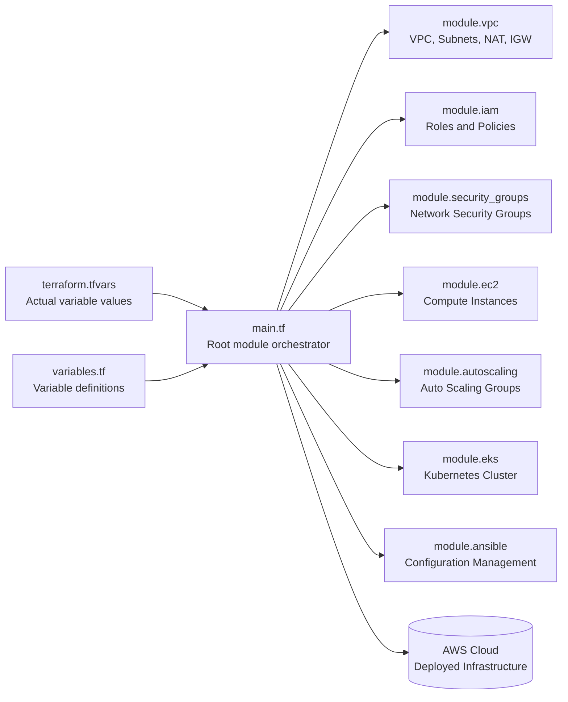

# AWS infrastructure by Terraform

---  
- [Overview](#overview)  
- [Features](#features)  
- [Architecture design](#Architecture-design)    

---

##  Overview

This repository is the base work of deploying AWS resources using Terraform.  
It is highly customizable and modular, allowing you to convert your infrastructure to code, allowing you to deploy it anywhere.  

---  
## Features  

- **VPC** — Private and public subnets, Internet Gateway, and NAT Gateway  
- **IAM** — Roles, policies, and access control  
- **Security Groups** — Controlled network access between resources  
- **EC2** — Compute instances  
- **Auto Scaling Group (ASG)** — Dynamic instance scaling  
- **EKS** — Managed Kubernetes cluster  
- **Ansible** — Configuration management and application deployment

All modules are orchestrated by the **root `main.tf`**, which pulls in variables from `variables.tf` and `terraform.tfvars` and deploys the infrastructure to **AWS**.
All the blocks have their own varibles.tf and outputs.tf, which can be edited at will.

---

##  Architecture design

RESUME HERE

---  
## 
